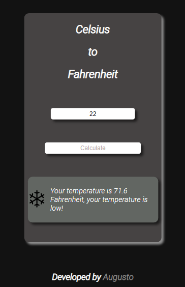
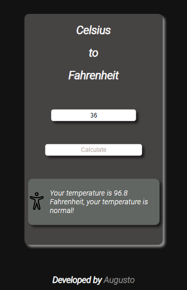
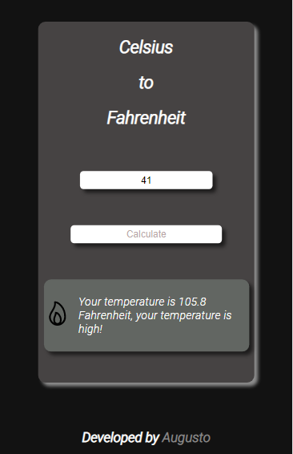
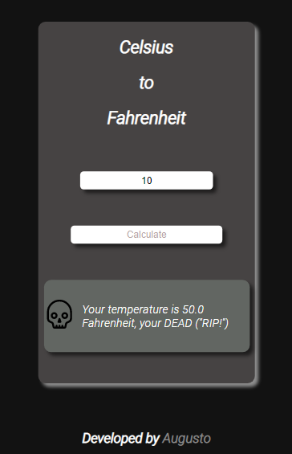

# About Celsius-to-Fahrenheit 📑

Little project , to calculate Celsius to Fahrenheit .

# Data 💾

1. Depending of the temperature will show a image on the left and how many fahrenheit you have .

2. If the temperature is less than 35 show you have a low temperature 🥶.

3. If the temperature is between 35 and 37,5 normal 🙂.

4. If the temperature is more than 37,5 you have a high temperature 🥵.

5. And the last one , if you have temperature less than 10 or more than 42 , RIP my friend 💀.

# Preview 🖥️

# Preview Low Temperature 🥶

# Preview Normal Temperature 🙂

# Preview High Temperature 🥵

# Preview Dead Temperature 💀

